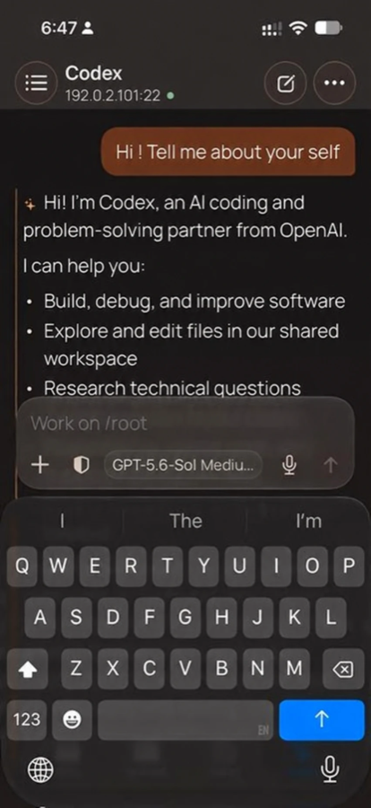
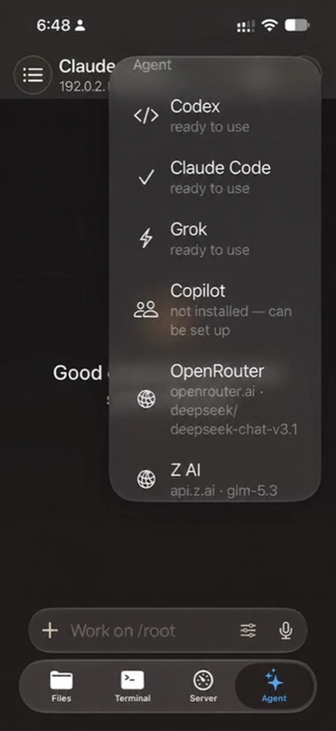
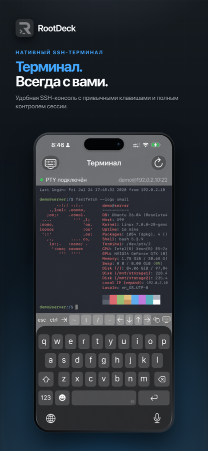
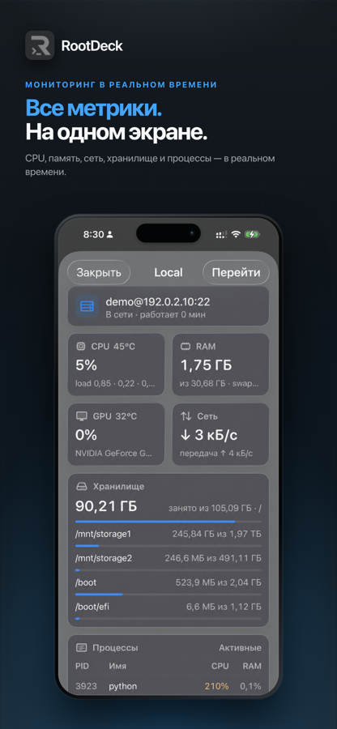
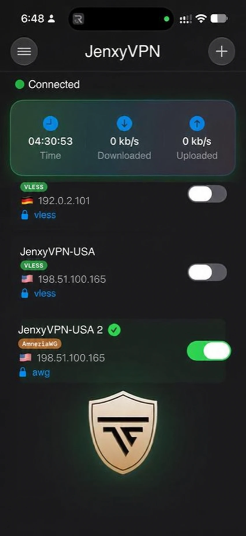
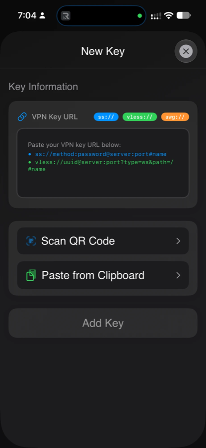

# Евгений — AI-assisted разработчик полного цикла

**Довожу продукты от идеи до выпуска: iOS, macOS, Android, Windows и сервер.
Работаю в связке с ИИ-агентами (Claude Code, Codex) — они дают скорость,
а архитектура, проверка и ответственность за результат остаются на мне.**

---

## Коротко

- **3 собственных продукта** в продакшене, один из них — [в App Store](https://apps.apple.com/app/id6794034566).
- **5 платформ:** iOS, iPadOS, macOS, Android, Windows + серверы на Linux.
- **От архитектуры до поддержки:** пишу код, настраиваю серверы, разбираю сбои
  по системным отчётам, публикую в магазины, веду документацию.
- **ИИ — рабочий инструмент каждый день**, с понятными правилами и проверками
  (см. [«Как я работаю с ИИ-агентами»](#как-я-работаю-с-ии-агентами)).

## В цифрах

| | |
|---|---|
| Код в трёх продуктах | **230+ тыс. строк** (Swift, Kotlin, C#, Python, JS) |
| Автотесты | **2 000+** |
| RootDeck: от создания репозитория до выпуска в Mac App Store | **5 недель** (11 июля → 15 августа 2026) |
| JenxyVPN: один продукт на | **4 платформах** + сервер, бот и админка |
| Sightcore: ускорение распознавания лиц | **в 3,1 раза** (590 → 192 мс) |
| JenxyVPN: время поднятия туннеля после оптимизации | **0,2 с** вместо 1,7–5 с |

---

## Продукты

### RootDeck — SSH-клиент с ИИ-агентами прямо на сервере

Управление серверами с iPhone, iPad, Mac и Android: терминал со вкладками и
сплитами, файлы по SFTP, мониторинг CPU / памяти / дисков / процессов, jump host,
поиск SSH-серверов в локальной сети. Главная фишка — **нативный чат с ИИ-агентами
(Codex, Claude Code и другими), которые работают на сервере пользователя**:
с телефона можно поручить агенту задачу на своём сервере и утверждать его
действия. Ключи провайдеров приложение не видит — они остаются на сервере.

**Моя роль:** всё — от архитектуры и кода до публикации в App Store.
**Стек:** SwiftUI, SwiftNIO SSH (свой форк библиотеки Citadel), Kotlin + Compose (порт на Android).
**Результат:** [опубликован в App Store](https://apps.apple.com/app/id6794034566); 68 тыс. строк Swift, 938 тестов; порт на Android — 30 тыс. строк Kotlin.

→ [Подробнее для технического интервью](projects/rootdeck.md)

### JenxyVPN — VPN-сервис: 4 клиента, серверы, бот и админка

Собственный VPN-клиент под iOS, macOS, Android и Windows с тремя протоколами
(Shadowsocks, VLESS, AmneziaWG), плюс серверная часть: 4 VPN-сервера,
Telegram-бот с мини-приложением для подписок и оплаты, админка для iPhone и Mac.

**Моя роль:** весь продукт — клиенты, сервер, инфраструктура, выкатка обновлений.
**Стек:** Swift / SwiftUI / Network Extension, Kotlin / Compose, C# / .NET / WPF,
Go (свои сборки сетевых ядер), Python / FastAPI / aiogram, PostgreSQL.
**Результат:** ~100 тыс. строк кода на 6 кодовых базах; 900+ тестов в
Apple-клиентах; стабильная работа iOS-расширений в жёстком лимите памяти 50 МБ.

→ [Подробнее для технического интервью](projects/jenxyvpn.md)

### Sightcore — распознавание лиц на проходных

Система доступа по лицу: GPU-сервер у камер узнаёт сотрудников, проверяет,
что перед камерой живой человек, а не фото, и открывает турникет. Операторы
видят живое видео с задержкой 0,3–0,5 с, базу сотрудников и журнал проходов;
одна система обслуживает несколько организаций.

**Моя роль:** архитектура, распознавание, веб-интерфейс, серверы, безопасность.
**Стек:** Python, FastAPI, InsightFace, YOLOv8, MediaPipe, PostgreSQL, WebRTC, nginx.
**Результат:** распознавание быстрее в 3,1 раза; закрыта уязвимость подмены
данных между организациями; резервный сервер в другой стране с проведёнными
учениями по переключению; 260 коммитов, 200+ тестов.

→ [Подробнее для технического интервью](projects/sightcore.md)

---

## Как я работаю с ИИ-агентами

Это не «спросил у чата и вставил код». У меня выстроен процесс, в котором агент
пишет быстро, а качество гарантируют правила и проверки.

1. **Правила для агента в каждом репозитории.** Файл `AGENTS.md` / `CLAUDE.md`:
   архитектура, команды сборки и тестов, соглашения, известные ловушки
   («не сохранять конфигурацию VPN дважды за одно подключение», «не деплоить
   этим скриптом — затрёт ручную настройку»). Агент начинает работу уже с
   контекстом проекта.
2. **Память между сессиями.** Итоги расследований, решения и их причины
   записываются в заметки проекта. Через неделю агент не «переоткрывает» уже
   найденную причину и не предлагает отвергнутое решение заново.
3. **Каждое утверждение — с доказательством.** Причина сбоя подтверждается
   системным отчётом, замером или логом, а не догадкой. Если данных нет — прямо
   говорю «не доказано» и называю, что нужно собрать.
4. **Обязательные проверки перед коммитом:** сборка, тесты, проверка на
   утечку секретов (gitleaks), проверка на реальном устройстве или сервере.
   Unit-тестов недостаточно: две ошибки в Sightcore жили на стыке модулей и
   нашлись только на живой проходной.
5. **Опасные действия — только с подтверждением.** Правки на боевых серверах
   готовятся с бэкапом и командой отката; пуш и выкатка — после моего решения.
6. **Модель — не источник правды.** Её ответы сверяю с документацией,
   исходниками и тестами. Я проверил локальную LLM как второго помощника на
   реальной задаче: из 7 ответов 3 оказались неверными при «высокой
   уверенности», один — вредным для безопасности. Помощника отключил, выводы
   записал.

→ [Подробнее: процесс и примеры](cases/08-ai-assisted-workflow.md)

---

## Несколько историй

**iOS обрывала VPN сама.** Туннель падал с «внутренней ошибкой» после многих
часов работы. По системному отчёту о памяти выяснил, что iOS выгружала свою
службу VPN, раздутую списком из 12 807 маршрутов. Заменил его автообновляемым
списком из 775 маршрутов с проверкой подлинности — туннель поднимается за
0,2 с вместо 1,7–5 с. → [разбор](cases/01-ios-vpn-routes-jetsam.md)

**VPN отключался под нагрузкой.** iOS убивала расширение за превышение лимита
50 МБ. Нашёл в сетевом ядре на Go буфер 512 КБ на каждое соединение, собрал
своё ядро с исправлением и перевёл обработку пакетов на прямую работу с
интерфейсом — speedtest на 100 Мбит/с больше не рвёт соединение.
→ [разбор](cases/02-ios-extension-50mb-xray.md)

**Распознавание лиц в 3 раза быстрее — и надёжнее.** Узким местом оказалась не
нейросеть, а логика решения: одно наблюдение вместо консенсуса, порог «на глаз».
Ускорил обработку с 590 до 192 мс, ввёл решение «k из n кадров», устранил
повторные записи прохода. → [разбор](cases/04-sightcore-recognition.md)

**Утечка между организациями.** Сервер доверял номеру бокса из тела запроса —
один бокс мог писать события за другой. Перевёл определение бокса на
персональные токены, а SSH-туннели — с root-доступа на ограниченного
пользователя; новый бокс теперь подключается сам.
→ [разбор](cases/05-sightcore-multitenant-security.md)

**Фоновые SSH-сессии на iOS.** Вместо споров «почему у конкурента держит, а у
нас нет» замерил поведение iOS `tcpdump` на сервере: система закрывает сокет
через ~5 с после конца фонового окна. Нашёл законный способ держать сессию —
теперь она живёт больше 5 минут под блокировкой экрана.
→ [разбор](cases/06-rootdeck-ios-background-ssh.md)

Все разборы: [01](cases/01-ios-vpn-routes-jetsam.md) ·
[02](cases/02-ios-extension-50mb-xray.md) · [03](cases/03-reconnect-loop.md) ·
[04](cases/04-sightcore-recognition.md) · [05](cases/05-sightcore-multitenant-security.md) ·
[06](cases/06-rootdeck-ios-background-ssh.md) · [07](cases/07-rootdeck-remote-agent.md) ·
[08](cases/08-ai-assisted-workflow.md)

---

## Навыки

| Область | Что использую |
|---|---|
| Apple | Swift, SwiftUI, Network Extension, Keychain, Live Activities, App Store Connect |
| Android | Kotlin, Jetpack Compose, VpnService |
| Windows | C#, .NET, WPF, службы Windows, DPAPI |
| Backend | Python, FastAPI, aiogram, PostgreSQL, SQLAlchemy, REST, WebSocket |
| Компьютерное зрение | InsightFace, YOLOv8, ByteTrack, MediaPipe, ONNX Runtime (GPU) |
| Сети и инфраструктура | Linux, nginx, systemd, SSH, WireGuard / AmneziaWG, Xray, WebRTC, Cloudflare |
| Системное | Go (gomobile, сборка ядер под iOS/macOS), диагностика по системным отчётам |
| ИИ | Claude Code, Codex, настройка агентов под проект, MCP |

---

_Код продуктов коммерческий и закрыт. Архитектуру и код покажу на встрече с
экрана._
